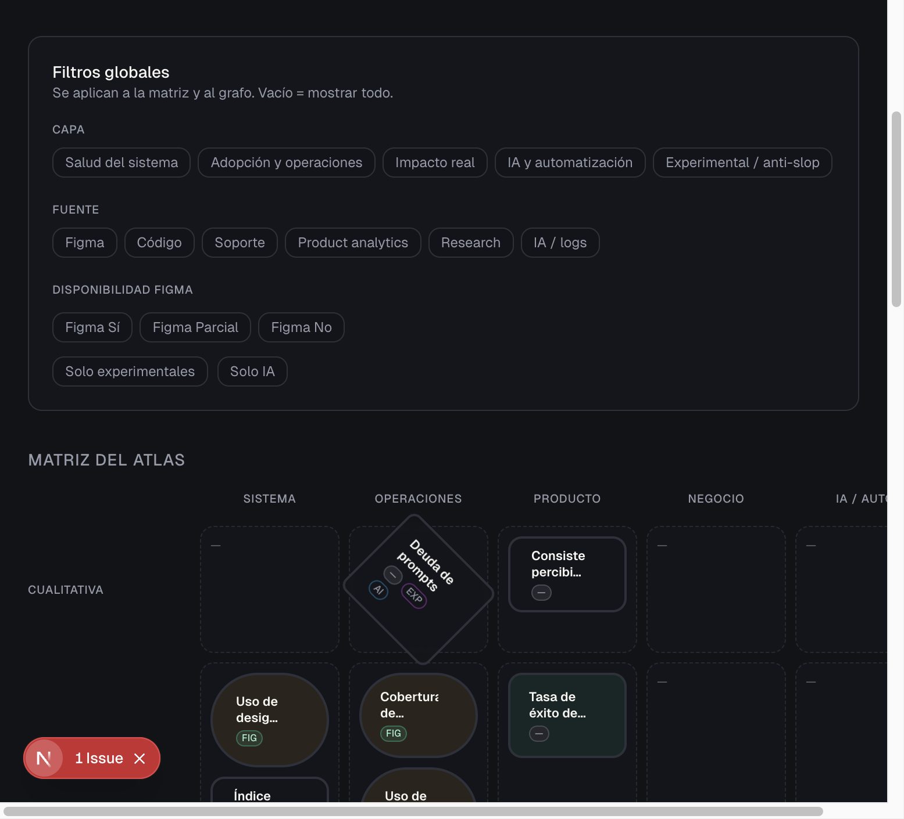
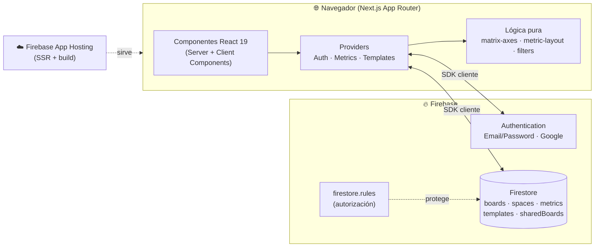
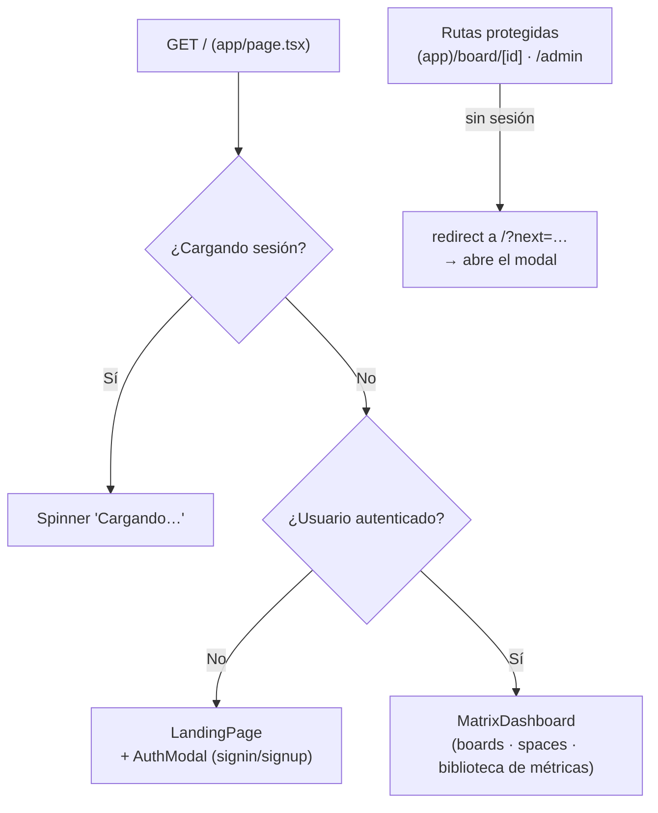
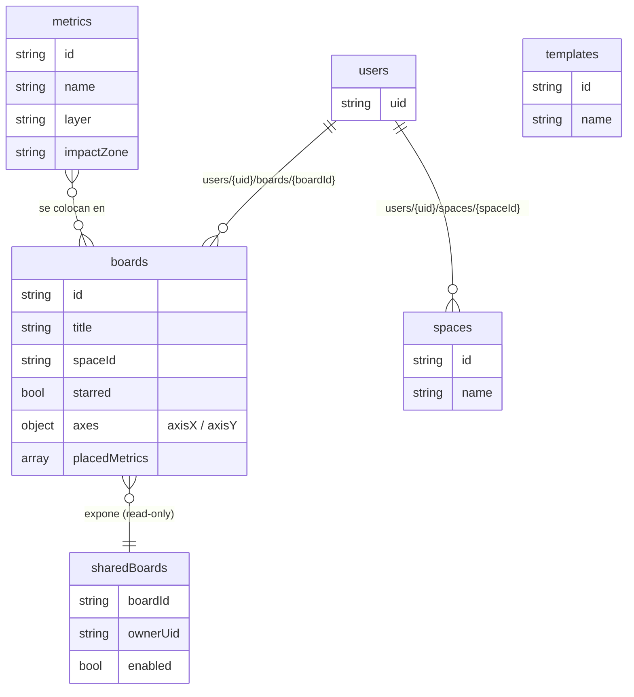

<div align="center">
  <h1>🗺️ Metric Atlas</h1>
  <p><strong>Enciclopedia visual e interactiva de métricas para Design Systems en la era de la IA.</strong></p>
  <p>
    
    
    
    
    
  </p>
</div>

<br />

<div align="center">
  
  <p><sub>Workspace de Metric Atlas: catálogo de métricas + lienzo de matriz 2×2.</sub></p>
</div>

---

## 📖 ¿Qué es Metric Atlas?

Metric Atlas es una herramienta para **catalogar, documentar y visualizar métricas de Design Systems**, pensada para equipos que trabajan con diseño, producto, desarrollo y automatización con IA.

La idea central: tomar un catálogo de métricas (cada una con su ficha rica) y **colocarlas en lienzos 2×2** donde cada eje es una variable de la métrica (tipo de medición, capa, fuente, madurez, calidad de señal, etc.). Así puedes razonar visualmente sobre qué medir, dónde está el valor y qué tiene mejor señal.

### Capacidades principales

- **🧭 Catálogo de métricas** — Cada métrica es una ficha con descripción, por qué importa, cómo medirla, fuentes, riesgos/sesgos y métricas relacionadas.
- **🟦 Lienzos 2×2 (estilo FigJam)** — Coloca métricas en una matriz arrastrando fichas; elige qué variable va en cada eje. Cada board es persistente y privado.
- **🗂️ Spaces** — Agrupa tus boards en carpetas.
- **🔍 Filtros dinámicos** — Filtra el catálogo por capa, fuente, tipo de medición, disponibilidad en Figma, experimental, relacionado con IA…
- **🔗 Compartir solo lectura** — Genera un enlace público de un board concreto sin exponer tu cuenta; revócalo cuando quieras.
- **🛠️ Panel de administración** — Gestiona el catálogo de métricas, plantillas de matriz y usuarios/roles desde `/admin`.

---

## 🏗️ Arquitectura

Aplicación **Next.js 15 (App Router)** desplegada con SSR en **Firebase App Hosting**, usando el **SDK de cliente de Firebase** (Auth + Firestore) directamente desde el navegador. No hay backend propio ni Admin SDK: la seguridad vive en las **reglas de Firestore**.



### Flujo de render en `/`

La raíz decide qué mostrar según el estado de sesión. **No existe una ruta `/login`**: la autenticación es un **modal** sobre la landing. (`/login` solo redirige a `/` por compatibilidad.)



---

## 🗂️ Estructura del proyecto

> La aplicación vive en el subdirectorio **`metric-atlas/`** del repositorio. El árbol
> de abajo (y los comandos de instalación más adelante) son relativos a esa carpeta.

```text
src/
├── app/                          # Next.js App Router
│   ├── layout.tsx                # Root layout (fuentes, <Providers>)
│   ├── providers.tsx             # Auth + Metrics + Templates providers
│   ├── page.tsx                  # Raíz: landing (modal) o dashboard según sesión
│   ├── error.tsx                 # Error boundary global
│   ├── (app)/                    # Grupo de rutas protegidas (AppGuardLayout)
│   │   ├── layout.tsx            #   guard: redirige a /?next= si no hay sesión
│   │   └── board/[id]/page.tsx   #   lienzo 2×2 de un board (AtlasWorkspace)
│   ├── share/[id]/page.tsx       # Board público de solo lectura (sin sesión)
│   ├── admin/                    # Panel de administración (guard de rol admin)
│   │   ├── page.tsx              #   inicio
│   │   ├── users/page.tsx        #   usuarios y roles
│   │   ├── metrics/page.tsx      #   edición del catálogo de métricas
│   │   └── templates/page.tsx    #   plantillas de matriz
│   └── api/metrics/route.ts      # GET público con el catálogo estático (JSON)
│
├── components/
│   ├── landing/landing-page.tsx  # Landing pública (usuarios no autenticados)
│   ├── auth/auth-modal.tsx       # Modal de login / registro
│   ├── dashboard/                # MatrixDashboard (vista principal autenticada)
│   ├── atlas/                    # Workspace del lienzo 2×2
│   │   ├── atlas-workspace.tsx   #   orquestador del board
│   │   ├── figjam-board.tsx      #   canvas arrastrable
│   │   ├── board-page-client.tsx #   carga/persistencia del board
│   │   ├── shared-board-client.tsx #  versión read-only para /share
│   │   └── metrics-tray · matrix-axis-controls · metric-insight-panel
│   ├── metric/                   # Biblioteca de métricas (EMBEBIDA, no es ruta)
│   │   ├── metrics-library.tsx   #   filtros + grid de resultados (se usa dentro
│   │   │                         #   de MatrixDashboard y AtlasWorkspace)
│   │   ├── metric-detail.tsx · related-metrics · metric-badges
│   ├── layout/filters-bar.tsx
│   └── ui/                       # Primitivas (button, badge, separator) Radix + CVA
│
├── lib/
│   ├── firebase/client.ts        # init de Firebase + isFirebaseConfigured
│   ├── auth/                      # AuthProvider + useAuth
│   ├── boards/                    # CRUD Firestore de boards/spaces + useBoards
│   ├── metrics/                   # MetricsProvider (suscripción a Firestore) + CRUD
│   ├── templates/                 # TemplatesProvider + CRUD de plantillas
│   ├── admin/                     # CRUD de roles/usuarios + useAdminGuard
│   ├── types.ts                   # Metric, AtlasFilters, MatrixAxis…
│   ├── matrix-boards.ts           # tipos y helpers de boards (sin I/O)
│   ├── matrix-axes.ts             # metricMapPosition + definición de ejes
│   ├── metric-layout.ts           # resolveMetricLayout (separación de solapes)
│   ├── filters.ts                 # filterMetrics
│   └── map-cluster · quadrant-viz · visual-encoding   # helpers de visualización
│
├── context/atlas-filters-context.tsx
├── data/
│   ├── metrics.ts                 # Catálogo semilla (servido por /api/metrics)
│   ├── filters.ts                 # Definición de filtros disponibles
│   └── legends.ts                 # Leyendas de la UI
└── styles/globals.css             # Design System (variables HSL, theming light/dark)
```

> **Nota:** la biblioteca de métricas **no es una ruta propia** (`/metrics`): es un
> componente (`metrics-library.tsx`) embebido tanto en `MatrixDashboard` como en
> `AtlasWorkspace`.

---

## 🧬 Modelo de datos

### Colecciones de Firestore



| Colección | Ruta | Privacidad |
| :--- | :--- | :--- |
| Boards | `users/{uid}/boards/{boardId}` | Privada por usuario |
| Spaces | `users/{uid}/spaces/{spaceId}` | Privada por usuario |
| Boards compartidos | `sharedBoards/{boardId}` | Lectura pública si `enabled` |
| Catálogo de métricas | `metrics/{id}` | Lectura global · escritura admin |
| Plantillas de matriz | `templates/{id}` | Lectura global · escritura admin |
| Perfiles / roles | `userProfiles/{uid}`, `admins/{uid}` | Gestión admin |

> El catálogo **en tiempo de ejecución** vive en la colección `metrics` de Firestore
> (lo edita un admin). El fichero `src/data/metrics.ts` es la **semilla** del catálogo
> y lo que sirve el endpoint público `GET /api/metrics`.

### La métrica (`Metric`)

Cada métrica es una ficha rica (ver `src/lib/types.ts`). Campos clave:

- **Clasificación:** `layer` (capa), `impactZone`, `measurementType`, `maturity`, `signalQuality`.
- **Origen:** `sourcePrimary` / `sourceSecondary`, `figmaAvailability`.
- **Flags:** `experimental`, `aiRelated`, `realtimePossible`, `archived`.
- **Contenido:** `description`, `whyItMatters`, `howToMeasure[]`, `risksBiases[]`, `relatedMetricIds[]`, `dashboardIdeas[]`, `automationIdeas[]`.

Cualquiera de estas variables puede usarse como **eje X o Y** de la matriz 2×2 (`MatrixAxisId`).

---

## 🎨 Design System

UI construida con **Tailwind CSS + Radix UI**, con sistema dual **light/dark** basado en **variables HSL** definidas en `src/styles/globals.css`. Es obligatorio usar los **tokens semánticos** (`bg-background`, `text-foreground`, `bg-primary`…) y evitar hex hardcodeados.

| Token | Light (Aero/Clean) | Dark (Deep/Gold) | Uso |
| :--- | :--- | :--- | :--- |
| **Background** | `210 20% 98%` | `220 16% 8%` | Fondo base |
| **Foreground** | `0 0% 12%` | `45 20% 96%` | Texto primario |
| **Primary / Accent** | `204 100% 53%` (azul) | `38 42% 58%` (oro) | CTAs, rings, highlights |
| **Card** | `0 0% 100%` | `220 14% 11%` | Tarjetas y modales |
| **Muted-foreground** | `0 0% 46%` | `220 10% 62%` | Texto secundario |
| **Border** | `0 0% 90%` | `220 12% 20%` | Divisores e inputs |
| **Radius** | `0.625rem` | `0.625rem` | Curvatura estándar |

- **Tipografía:** Inter (sans) + JetBrains Mono (mono) vía `next/font`, con `optimizeLegibility` y *stylistic sets*.
- **Componentes:** primitivas accesibles de Radix UI + `class-variance-authority` para variantes.

---

## 🚀 Puesta en marcha local

### 1. Configurar Firebase
1. Crea un proyecto en [Firebase Console](https://console.firebase.google.com).
2. **Authentication** → habilita `Email/Password` y `Google`.
3. **Firestore Database** → modo nativo.
4. Copia las credenciales web desde *Configuración del proyecto → Tus apps*.

### 2. Variables de entorno
```bash
cd metric-atlas            # la app vive en este subdirectorio
cp .env.example .env.local
```
Rellena las variables `NEXT_PUBLIC_FIREBASE_*` con los datos de tu proyecto.

> ⚠️ **Importante:** estas variables `NEXT_PUBLIC_*` son la **config web pública** de
> Firebase (no son secretos: van al bundle del cliente por diseño). La seguridad real
> la dan las reglas de Firestore y los dominios autorizados. Aun así, **sin ellas**
> `isFirebaseConfigured` será `false` y la app solo mostrará la landing (sin auth ni
> Firestore).

### 3. Instalar y arrancar
```bash
npm install
npm run dev          # http://localhost:3000
```

---

## 🛡️ Seguridad y despliegue

### Reglas de Firestore
La autorización vive en `firestore.rules` (cada usuario solo accede a `users/{uid}/...`). Despliégalas con:
```bash
npm install -g firebase-tools
firebase login
firebase use --add                      # selecciona tu proyecto
firebase deploy --only firestore:rules
```

### Firebase App Hosting (SSR)
1. Sube el repo a GitHub.
2. En Firebase Console → **App Hosting** → enlaza el repo.
3. Define las variables `NEXT_PUBLIC_FIREBASE_*` del entorno. En el repo, `apphosting.yaml`
   las declara con `value: ""`; **debes rellenarlas** (o inyectarlas como secrets del
   backend) **antes de desplegar**, o la app arrancará sin auth ni Firestore.
4. Cada push a la rama principal lanza un despliegue automático.

---

## 🛠️ Comandos

| Comando | Descripción |
| :--- | :--- |
| `npm run dev` | Servidor de desarrollo en `localhost:3000`. |
| `npm run build` | Build de producción. |
| `npm run start` | Servidor de producción (tras `build`). |
| `npm run lint` | ESLint. |

> Actualmente la validación se apoya en `lint` + `build` (aún no hay runner de tests configurado).

---

## 🧱 Stack

**Next.js 15** · **React 19** · **TypeScript 5** · **Tailwind CSS 3** · **Radix UI** · **lucide-react** · **Firebase 12** (Auth + Firestore) · **Firebase App Hosting**.

<br />

<div align="center">
  <i>Desarrollado combinando Diseño, Datos e IA.</i>
</div>
